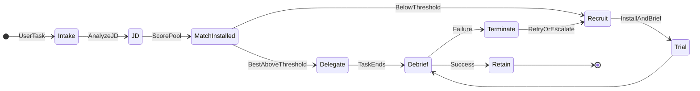
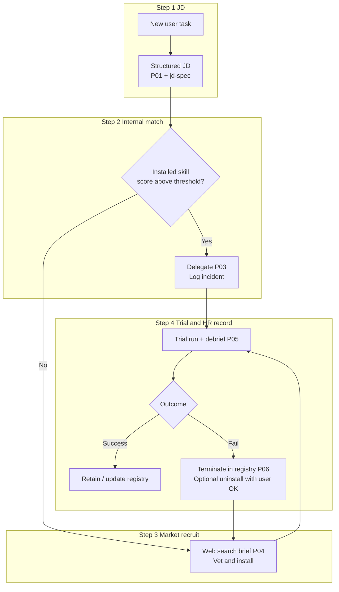

# skill-hr

**Language / 语言:** [简体中文](README.md) | English (this page)

[](https://opensource.org/licenses/MIT)
[](https://support.anthropic.com/en/articles/12580037-what-are-skills)
[](https://agentskills.io)

<!-- When the repo is public on GitHub: uncomment the line below and set OWNER/REPO for a live stars badge
[](https://github.com/OWNER/REPO)
-->

**Meta Agent Skill · HR / orchestration for the Skill ecosystem**

> **Too many skills installed—still guessing who to dispatch on each task?**  
> **Stop stacking plugins; hire an HR function for your host.**

- **Structured JDs**: every assignment starts as a job description (P01), then you pick who runs it.
- **Scored internal bench**: installed skills are matched with a rubric (P02), not gut feel.
- **Recruiting + records**: gaps go through market briefs and vetting (P04); **registry + incidents** are your HRIS; default is **logical termination** (`terminated`); **physical uninstall only after you explicitly OK it**.
- **Workforce upgrade**: `registry.json` now supports first-class multi-skill **`employees[]`**, plus a dedicated **`trainer`** role for employee design and retraining.
- **Multi-agent HR department (optional)**: besides “one session runs the whole flow,” you can split by role—each persona has a `SOUL.md` under [`agents/`](packages/skill-hr/agents/); shared rules in [`agents/GLOBAL.md`](packages/skill-hr/agents/GLOBAL.md). Task board and legal state transitions go through [`scripts/hr_dispatch.py`](packages/skill-hr/scripts/hr_dispatch.py) into **`.skill-hr/hr_tasks.json`** (see [`06-state-and-artifacts.md`](packages/skill-hr/references/06-state-and-artifacts.md)).

Open-source **meta [Agent Skill](https://support.anthropic.com/en/articles/12580037-what-are-skills)**: treat Skills as a workforce with headcount, hiring, and performance—**executable people ops**, not a throwaway metaphor. The installable bundle lives under [`packages/skill-hr/`](packages/skill-hr/).

---

<span id="demo"></span>

## Demo


This ships with a **placeholder GIF** in-repo. Replace [`docs/demo/skill-hr-demo.gif`](docs/demo/skill-hr-demo.gif) after you record a real run. Specs, script, and an ffmpeg example live in [**docs/demo/README.md**](docs/demo/README.md). Static fallback: [`docs/demo/skill-hr-demo.png`](docs/demo/skill-hr-demo.png).

---

<span id="quick-start"></span>

## 30-second quick start

1. **Copy** [`packages/skill-hr/`](packages/skill-hr/) into your host skills tree as **`skill-hr/`** so **`skill-hr/SKILL.md`** exists.
2. **Claude Code**: read [`references/hosts/claude-code.md`](packages/skill-hr/references/hosts/claude-code.md). Typical paths: `<repo>/.claude/skills/skill-hr/` or `~/.claude/skills/skill-hr/`.
3. **OpenClaw**: read [`references/hosts/openclaw.md`](packages/skill-hr/references/hosts/openclaw.md).

**Optional: scan the on-disk bench (P02 aid)**

```bash
python packages/skill-hr/scripts/scan_claude_code_skills.py <workspace> [--include-user]
```

**Optional: validate HR ledger JSON**

```bash
python packages/skill-hr/scripts/validate_registry.py .skill-hr/registry.json
```

**Optional: task board in multi-agent mode (state machine + handoff audit)**

Run from the **workspace root** (first `create` will create `.skill-hr/` if needed):

```bash
python packages/skill-hr/scripts/hr_dispatch.py create HR-20260405-001 "Example task"
python packages/skill-hr/scripts/hr_dispatch.py state HR-20260405-001 JDReady "P01 done"
python packages/skill-hr/scripts/hr_dispatch.py list
```

End-to-end walk-through: [`examples/multi-agent-flow.md`](packages/skill-hr/examples/multi-agent-flow.md).

**Optional: launch the local dashboard (business board + employee views + archive + templates)**

```bash
cd dashboard
npm install
npm run build

# In another terminal at the repo root
python packages/skill-hr/scripts/server.py --port 8787
```

Then open `http://127.0.0.1:8787`. The server reuses workspace `.skill-hr/registry.json`, `.skill-hr/hr_tasks.json`, and `incidents/`.

Optional: add a one-liner in project instructions (e.g. `CLAUDE.md`) for **when** to invoke skill-hr; procedures stay in `SKILL.md` and `references/`. **Rules kick off work; the skill teaches how to run it.**  
`.skillhub.json` next to a skill (if any) is marketplace metadata; HR state lives in **`.skill-hr/registry.json`**; multi-agent runs also use **`.skill-hr/hr_tasks.json`**.

---

## Table of contents

- [Demo](#demo)
- [30-second quick start](#quick-start)
- [Multi-agent HR department](#multi-agent)
- [Why skill-hr](#why-skill-hr)
- [Host support](#hosts)
- [Without HR vs with skill-hr](#before-after)
- [What you get](#features)
- [OpenClaw: completion-first](#openclaw-completion)
- [Architecture diagrams](#architecture)
- [Docs (Reference)](#doc-map)
- [Cursor and AGENTS](#cursor-agents)
- [Safety](#safety)
- [Framework evaluation](#evaluation)
- [Validate registry](#validate-registry)
- [FAQ](#faq)
- [License](#license)

---

<span id="why-skill-hr"></span>

## Why skill-hr

- **More skills, harder choices**—without a shared JD and scoring rubric, dispatch stays ad hoc.
- **Bench vs market**—easy to miss a strong internal match or to install from the web without vetting and handoff.
- **No paper trail on failure**—who is reliable, on probation, or should be logically fired stays fuzzy.
- **“Delete skill” is ambiguous**—must separate **removing from the dispatch pool** from **deleting directories on disk**.

skill-hr encodes the workflow in [`SKILL.md`](packages/skill-hr/SKILL.md) and `references/`, driven by prompt templates **P01–P06**, with workspace state under **`.skill-hr/`** (see [`06-state-and-artifacts.md`](packages/skill-hr/references/06-state-and-artifacts.md)).

---

<span id="multi-agent"></span>

## Multi-agent HR department

When the host supports **multiple agent sessions**, you can split HR into dedicated roles (similar in spirit to audited, role-based multi-agent setups; see for example the community project [edict](https://github.com/cft0808/edict)). **Single-session hosts** still follow one `SKILL.md` Mandatory flow end to end; alternatively one process loads **hr-director** and applies each `SOUL.md` as a phase.

| Agent ID | Role (summary) |
|----------|----------------|
| `hr-director` | Orchestration, user comms, branch decisions |
| `job-analyst` | P01 job description / JD |
| `talent-assessor` | P02 internal matching and scoring |
| `recruiter` | P04 market search and install coordination |
| `compliance` | Safety and veto gates |
| `onboarder` | P03 delegation and handoff package |
| `perf-manager` | P05 debrief / P06 termination |
| `hris-admin` | Registry and incidents discipline |

- **Everyone reads**: [`agents/GLOBAL.md`](packages/skill-hr/agents/GLOBAL.md) (permission matrix, red lines, `hr_dispatch.py` usage)
- **Per-role briefs**: [`agents/*/SOUL.md`](packages/skill-hr/agents/)
- **Worked example**: [`examples/multi-agent-flow.md`](packages/skill-hr/examples/multi-agent-flow.md)

---

<span id="hosts"></span>

## Host support

| Host | Status | Notes |
|------|--------|-------|
| **Claude Code** | Primary | Paths, nested `.claude/skills/`, `--add-dir`, plugin discovery: [`hosts/claude-code.md`](packages/skill-hr/references/hosts/claude-code.md). Pair P02 with the disk scan script when helpful. |
| **OpenClaw** | Primary | Deploy this bundle as **dedicated HR for skills**; completion-first semantics below. See [`hosts/openclaw.md`](packages/skill-hr/references/hosts/openclaw.md). |
| **Cursor** | Optional | Project rules decide when to load skill-hr—[`.cursor/rules/skill-hr-always.mdc`](.cursor/rules/skill-hr-always.mdc) (tune `alwaysApply` / `globs`). |

---

<span id="before-after"></span>

## Without HR vs with skill-hr

| Without HR | With skill-hr |
|------------|---------------|
| Pick a skill or install another by gut | **Structured JD** (P01), then **scored internal match** (P02) |
| `curl \| sh` from the web | **Search brief + vetting** (P04), scripted install and handoff |
| “Try another one” after failure | **Trial and debrief** (P05), **termination report** (P06), registry/incidents |
| “Delete” might wipe folders | Default **logical termination** (`terminated`); **physical uninstall** only after explicit OK + path audit |

**In one line**: skill-hr defaults to **logical termination in the ledger**; deleting folders is a separate, explicit, audited step.

---

<span id="features"></span>

## What you get

<details>
<summary><strong>Expand: full feature list and links</strong></summary>

- **Orchestration and gates**: [`packages/skill-hr/SKILL.md`](packages/skill-hr/SKILL.md) (mandatory flow, self-routing, safety, multi-agent overview)
- **Multi-agent global rules**: [`agents/GLOBAL.md`](packages/skill-hr/agents/GLOBAL.md); **per-agent SOUL files**: [`agents/`](packages/skill-hr/agents/)
- **Task board CLI**: [`scripts/hr_dispatch.py`](packages/skill-hr/scripts/hr_dispatch.py)
- **Multi-agent walk-through**: [`examples/multi-agent-flow.md`](packages/skill-hr/examples/multi-agent-flow.md)
- **Playbooks** (competencies, JD, matching, hiring, performance, termination, escalation): [`references/`](packages/skill-hr/references/)
- **Prompt templates P01–P06**: [`references/prompts/`](packages/skill-hr/references/prompts/)
- **Host install notes**: [`references/hosts/`](packages/skill-hr/references/hosts/)
- **Registry / incident / hr_tasks schema**: [`06-state-and-artifacts.md`](packages/skill-hr/references/06-state-and-artifacts.md)
- **Example registry**: [`examples/registry.example.json`](packages/skill-hr/examples/registry.example.json)
- **JSON validation**: [`scripts/validate_registry.py`](packages/skill-hr/scripts/validate_registry.py)
- **Full-stack evaluation L0–L7** (P02 benchmark = layer L2): [`08-framework-evaluation.md`](packages/skill-hr/references/08-framework-evaluation.md)
- **P02 gold cases and metrics**: [`benchmarks/matching/`](packages/skill-hr/benchmarks/matching/)
- **P02 output schema**: [`schemas/p02-output.schema.json`](packages/skill-hr/schemas/p02-output.schema.json)
- **Benchmark scorer**: [`scripts/compare_matching_benchmark.py`](packages/skill-hr/scripts/compare_matching_benchmark.py)
- **Claude Code on-disk skill scan (P02 aid)**: [`scripts/scan_claude_code_skills.py`](packages/skill-hr/scripts/scan_claude_code_skills.py)

</details>

---

<span id="openclaw-completion"></span>

## OpenClaw: completion-first

On OpenClaw, the framework is **completion-first**: keep executing documented, vetted, low-risk host steps until a real **completion checkpoint** or a proven **blocker**, then report.

- **`delegate`**: **dispatch now and keep executing** until the incumbent completes or proves blocked.
- **`confirm`**: reserve for **real user gates** (destructive actions, missing credentials, manual-only host steps).
- **Recruitment briefs** split **agent-continuable** steps from **user-gated** steps.
- **Phase-by-phase narration** belongs in `.skill-hr/incidents/`; user-facing replies default to **outcomes, artifacts, pending items, and blockers**.

<details>
<summary><strong>Expand: full wording (same as previous README)</strong></summary>

On OpenClaw, the framework is **completion-first**: if the next step is documented, vetted, and safe for the agent to execute, keep going until you reach a real **completion checkpoint** or a proven **blocker**, then report back.

- **`delegate`**: **dispatch now and keep executing** until the incumbent reaches completion or proves blocked.
- **`confirm`**: reserve for **real user gates** (destructive actions, missing credentials, host steps that are manual-only).
- **Recruitment briefs** split **agent-continuable steps** from **user-gated steps** so runs can flow through install, verification, and smoke delegation after approval.
- **Phase-by-phase narration** belongs in `.skill-hr/incidents/`; user-facing replies should default to **outcomes, artifacts, and blockers**, not a long “here is what I will do next.”

</details>

---

<span id="architecture"></span>

## Architecture diagrams

<details>
<summary><strong>Diagram 1: HR lifecycle (orchestration state machine)</strong></summary>

Behind each user request: **recruit → trial → debrief → retain or improve → hire again if needed**.



</details>

<details>
<summary><strong>Diagram 2: Four-step mapping (what HR does)</strong></summary>



</details>

<details>
<summary><strong>Diagram 3: Repository layout vs runtime artifacts</strong></summary>



</details>

```mermaid
flowchart LR
  subgraph repo [Repository root]
    R[README.md]
    A[AGENTS.md]
    CR[.cursor/rules]
  end
  subgraph pkg [packages/skill-hr skill bundle]
    S[SKILL.md]
    AG[agents GLOBAL + SOUL]
    REF[references/00-08]
    PR[prompts P01-P06]
    HO[hosts claude-code + openclaw]
    SC[scripts validate + hr_dispatch]
  end
  subgraph runtime [Workspace at runtime]
    REG[.skill-hr/registry.json]
    TASKS[.skill-hr/hr_tasks.json]
    INC[.skill-hr/incidents/]
  end
  repo --> pkg
  pkg -.->|creates or updates| runtime
```

**Bundle size hint**: about **28** `.md` files under `packages/skill-hr/` (1× `SKILL.md`, 9× `references/0x–08`, 1× `matching-lexicon`, 6× prompts, 2× hosts, `agents/GLOBAL.md`, 8× `agents/*/SOUL.md`), plus repo-level docs and scripts.

---

<span id="doc-map"></span>

## Docs (Reference)

<details>
<summary><strong>Expand: documentation map</strong></summary>

| Topic | Link |
|-------|------|
| Control plane (triggers, flow, gates) | [`packages/skill-hr/SKILL.md`](packages/skill-hr/SKILL.md) |
| Multi-agent rules and personas | [`packages/skill-hr/agents/GLOBAL.md`](packages/skill-hr/agents/GLOBAL.md), [`packages/skill-hr/agents/`](packages/skill-hr/agents/) |
| HR task board CLI | [`packages/skill-hr/scripts/hr_dispatch.py`](packages/skill-hr/scripts/hr_dispatch.py) |
| Multi-agent example | [`packages/skill-hr/examples/multi-agent-flow.md`](packages/skill-hr/examples/multi-agent-flow.md) |
| All playbooks | [`packages/skill-hr/references/`](packages/skill-hr/references/) |
| Prompts P01–P06 | [`packages/skill-hr/references/prompts/`](packages/skill-hr/references/prompts/) |
| Claude Code / OpenClaw install | [`packages/skill-hr/references/hosts/`](packages/skill-hr/references/hosts/) |
| Registry / incident / hr_tasks spec | [`packages/skill-hr/references/06-state-and-artifacts.md`](packages/skill-hr/references/06-state-and-artifacts.md) |
| Example registry | [`packages/skill-hr/examples/registry.example.json`](packages/skill-hr/examples/registry.example.json) |
| Registry validator | [`packages/skill-hr/scripts/validate_registry.py`](packages/skill-hr/scripts/validate_registry.py) |
| L0–L7 evaluation plan | [`packages/skill-hr/references/08-framework-evaluation.md`](packages/skill-hr/references/08-framework-evaluation.md) |
| P02 benchmark data | [`packages/skill-hr/benchmarks/matching/`](packages/skill-hr/benchmarks/matching/) |
| P02 JSON Schema | [`packages/skill-hr/schemas/p02-output.schema.json`](packages/skill-hr/schemas/p02-output.schema.json) |
| Benchmark comparison script | [`packages/skill-hr/scripts/compare_matching_benchmark.py`](packages/skill-hr/scripts/compare_matching_benchmark.py) |
| CC disk skill scan | [`packages/skill-hr/scripts/scan_claude_code_skills.py`](packages/skill-hr/scripts/scan_claude_code_skills.py) |

</details>

---

<span id="cursor-agents"></span>

## Cursor and AGENTS

- Optional rule: [`.cursor/rules/skill-hr-always.mdc`](.cursor/rules/skill-hr-always.mdc)
- Agent entry summary: [`AGENTS.md`](AGENTS.md)

---

<span id="safety"></span>

## Safety

- Third-party skills may be malicious—**vet** before install; do not run unreviewed **`curl | sh`**.
- **“Delete skill”** defaults to **logical termination** in the registry (`terminated`), not silent filesystem removal.
- **Physical uninstall** only after **explicit user confirmation** and path audit.
- Veto list: [`01-competency-model.md`](packages/skill-hr/references/01-competency-model.md)

---

<span id="evaluation"></span>

## Framework evaluation

The **full-stack** plan (L0–L7: package integrity, P01–P06 behavior, registry, safety, E2E) is [`08-framework-evaluation.md`](packages/skill-hr/references/08-framework-evaluation.md). The older “benchmark = P02 only” workflow is **layer L2** inside that plan; commands and gold cases live in that doc and under [`benchmarks/matching/`](packages/skill-hr/benchmarks/matching/).

---

<span id="validate-registry"></span>

## Validate registry

```bash
python packages/skill-hr/scripts/validate_registry.py .skill-hr/registry.json
```

---

<span id="faq"></span>

## FAQ

**How is this different from “install more plugins / skills”?**  
More installs only add candidates. skill-hr adds a **shared JD, scoring, recruiting, trial, ledger, and termination semantics** so the host dispatches with a process instead of luck.

**Does skill-hr replace domain skills?**  
No. It owns **selection, handoff, records, and retirement**; the chosen domain skill still executes work per its `SKILL.md`. See the opening of [`packages/skill-hr/SKILL.md`](packages/skill-hr/SKILL.md).

**Should `.skill-hr/` be committed to git?**  
Team choice: commit if you want a **shared project ledger and incidents**; use `.gitignore` or redact if sensitive.

**Do I copy P01–P06 into chat by hand?**  
No. They are **templates** under `references/prompts/`; after the skill loads, follow the Mandatory flow in [`SKILL.md`](packages/skill-hr/SKILL.md) and pull them progressively.

**What about marketplace skills?**  
**Vet** first; avoid unknown installers. See [Safety](#safety) and [`01-competency-model.md`](packages/skill-hr/references/01-competency-model.md).

**How does this relate to `skill-creator` or `find-skills`?**  
`skill-creator` focuses on **authoring/updating skills**; `find-skills` on **discovery and install leads**; skill-hr on **full lifecycle and HRIS-style state**. They compose: find or author a skill, then let skill-hr handle matching, delegation, and performance records.

**Do multi-agent mode and “one agent runs skill-hr” conflict?**  
No. Multi-agent is an **optional deployment**: use `agents/*/SOUL.md` plus `hr_dispatch.py` when you have multiple sessions; otherwise follow the single Mandatory flow in [`SKILL.md`](packages/skill-hr/SKILL.md).

---

<span id="license"></span>

## License

MIT — [`packages/skill-hr/LICENSE`](packages/skill-hr/LICENSE)

---

If this repo helps you, a **Star** on GitHub makes updates easier to find; open an **Issue** when something breaks. Uncomment the stars badge at the top and set `OWNER/REPO` once the repository is public.
