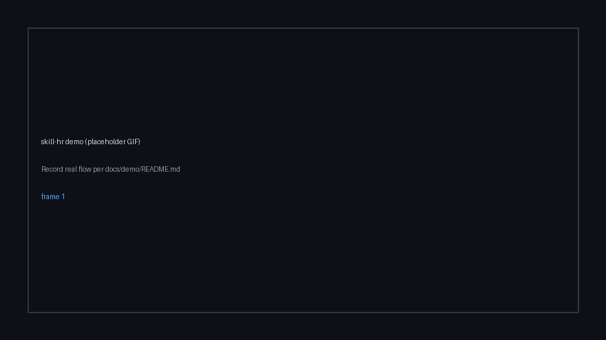
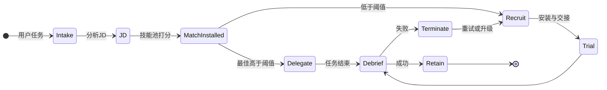
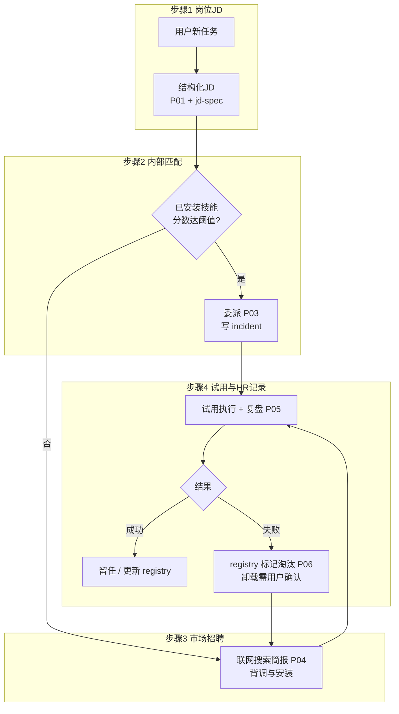
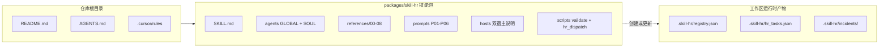

# skill-hr

**语言 / Language:** 简体中文（本页） | [English](README.en.md)

[](https://opensource.org/licenses/MIT)
[](https://support.anthropic.com/en/articles/12580037-what-are-skills)
[](https://agentskills.io)

<!-- 仓库公开到 GitHub 后：取消下一行注释，并把 OWNER/REPO 换成真实路径，即可显示 Star 数
[](https://github.com/OWNER/REPO)
-->

**Meta Agent Skill · Skill 生态 HR / 编排**

> **技能装了一箩筐，任务一来还是不知道派谁？**  
> **别再加插件了，先给宿主招个 HR。**

- **JD 结构化**：任务先落成岗位说明（P01），再谈派谁。
- **内池打分**：已安装技能按 rubric 匹配（P02），不是拍脑袋。
- **招聘 + 台账**：缺口走市场简报与 vetting（P04），**registry / incidents** 当 HRIS；默认 **逻辑淘汰**（`terminated`），**物理卸载只在你点头之后**。
- **员工层升级**：`registry.json` 现支持 **`employees[]` 多技能员工**，并提供 **`trainer`** 角色负责设计与训练。
- **多角色 HR 部门（可选）**：除「单会话跑完全流程」外，可按角色拆分——[`agents/`](packages/skill-hr/agents/) 下每人格一份 `SOUL.md`，共享规则见 [`agents/GLOBAL.md`](packages/skill-hr/agents/GLOBAL.md)；任务看板与合法状态迁移由 [`scripts/hr_dispatch.py`](packages/skill-hr/scripts/hr_dispatch.py) 写入 **`.skill-hr/hr_tasks.json`**（详见 [`06-state-and-artifacts.md`](packages/skill-hr/references/06-state-and-artifacts.md)）。

开源 **元 [Agent Skill](https://support.anthropic.com/en/articles/12580037-what-are-skills)**：把 Skill 当成一支要管编制、招聘、绩效的队伍——**可执行的 people-ops**，不是一句比喻。可安装包在 [`packages/skill-hr/`](packages/skill-hr/)。

---

<span id="demo"></span>

## 演示



当前为仓库内置 **占位 GIF**；录制真实流程后覆盖 [`docs/demo/skill-hr-demo.gif`](docs/demo/skill-hr-demo.gif) 即可。规格、脚本与 ffmpeg 示例见 [**docs/demo/README.md**](docs/demo/README.md)。静态图 fallback：[`docs/demo/skill-hr-demo.png`](docs/demo/skill-hr-demo.png)。

---

<span id="quick-start"></span>

## 30 秒上手

1. 将 [`packages/skill-hr/`](packages/skill-hr/) **复制**到宿主 skills 目录下的 **`skill-hr/`**，确保存在 **`skill-hr/SKILL.md`**。
2. **Claude Code**：读 [`references/hosts/claude-code.md`](packages/skill-hr/references/hosts/claude-code.md)。常见路径：`<repo>/.claude/skills/skill-hr/` 或 `~/.claude/skills/skill-hr/`。
3. **OpenClaw**：读 [`references/hosts/openclaw.md`](packages/skill-hr/references/hosts/openclaw.md)。

**可选：内池扫描（P02 辅助）**

```bash
python packages/skill-hr/scripts/scan_claude_code_skills.py <工作区> [--include-user]
```

**可选：校验 HR 台账 JSON**

```bash
python packages/skill-hr/scripts/validate_registry.py .skill-hr/registry.json
```

**可选：多角色模式下的任务看板（状态机 + 流转审计）**

在工作区根目录执行（首次 `create` 会创建 `.skill-hr/`）：

```bash
python packages/skill-hr/scripts/hr_dispatch.py create HR-20260405-001 "示例任务"
python packages/skill-hr/scripts/hr_dispatch.py state HR-20260405-001 JDReady "P01 完成"
python packages/skill-hr/scripts/hr_dispatch.py list
```

完整示例见 [`examples/multi-agent-flow.md`](packages/skill-hr/examples/multi-agent-flow.md)。

**可选：启动本地 Dashboard（业务看板 + 员工看板 + 归档 + 模板）**

```bash
cd dashboard
npm install
npm run build

# 另一个终端，在仓库根目录
python packages/skill-hr/scripts/server.py --port 8787
```

然后打开 `http://127.0.0.1:8787`。服务会复用工作区根目录下的 `.skill-hr/registry.json`、`.skill-hr/hr_tasks.json` 与 `incidents/`。

建议在项目说明（如 `CLAUDE.md`）里 **一句话写清何时启用 skill-hr**；细则只在 `SKILL.md` 与 `references/`。**规则负责喊开工，skill 负责教怎么干。**  
技能旁的 `.skillhub.json`（若有）是集市元数据；人事记录请用 **`.skill-hr/registry.json`**；多角色编排时另有一份 **`.skill-hr/hr_tasks.json`**。

---

## 目录

- [演示](#demo)
- [30 秒上手](#quick-start)
- [多角色 HR 部门](#multi-agent)
- [为什么是 skill-hr](#why-skill-hr)
- [宿主支持](#hosts)
- [没有 HR vs 有 skill-hr](#before-after)
- [能力一览](#features)
- [OpenClaw：完成优先](#openclaw-completion)
- [架构与图示](#architecture)
- [文档（Reference）](#doc-map)
- [Cursor 与 AGENTS](#cursor-agents)
- [安全](#safety)
- [框架测评](#evaluation)
- [校验 registry](#validate-registry)
- [常见问题（FAQ）](#faq)
- [许可证](#license)

---

<span id="why-skill-hr"></span>

## 为什么是 skill-hr

- **技能越多，越难选对**：缺统一 JD 与打分标准，委派靠直觉。
- **内池与市场脱节**：不知道「家里有没有合适的人」，出门安装又缺 vetting 与交接剧本。
- **翻车没台账**：谁稳、谁该 probation、谁该逻辑淘汰，没有结构化记录。
- **「删技能」语义危险**：必须区分 **从委派池移除** 与 **动磁盘上的目录**。

skill-hr 把上述环节写进 [`SKILL.md`](packages/skill-hr/SKILL.md) 与 `references/`，用 **P01–P06** 提示词模板驱动，状态落在工作区 **`.skill-hr/`**（见 [`06-state-and-artifacts.md`](packages/skill-hr/references/06-state-and-artifacts.md)）。

---

<span id="multi-agent"></span>

## 多角色 HR 部门

宿主支持 **多个 agent 会话** 时，可把 HR 拆成专职角色（类似多代理编排里的「分角色、可审计」思路；概念上可参考社区项目 [edict](https://github.com/cft0808/edict) 的多 Agent 分工）。**单会话宿主** 仍由一份 `SKILL.md` 按 Mandatory flow 顺序执行即可；也可由 **hr-director** 人格在内部按阶段加载各 `SOUL.md`。

| Agent ID | 职责摘要 |
|----------|----------|
| `hr-director` | 编排、对用户沟通、分支决策 |
| `job-analyst` | P01 岗位说明 / JD |
| `talent-assessor` | P02 内池匹配与打分 |
| `recruiter` | P04 市场搜索与安装协调 |
| `compliance` | 安全与 veto 门禁 |
| `onboarder` | P03 委派与交接包 |
| `perf-manager` | P05 复盘 / P06 淘汰 |
| `hris-admin` | registry、incidents 规范落盘 |

- **全员必读**：[`agents/GLOBAL.md`](packages/skill-hr/agents/GLOBAL.md)（权限矩阵、红线、`hr_dispatch.py` 用法）
- **各角色细则**：[`agents/*/SOUL.md`](packages/skill-hr/agents/)
- **走通示例**：[`examples/multi-agent-flow.md`](packages/skill-hr/examples/multi-agent-flow.md)

---

<span id="hosts"></span>

## 宿主支持

| 宿主 | 状态 | 说明 |
|------|------|------|
| **Claude Code** | 主推 | 路径优先级、嵌套 `.claude/skills/`、`--add-dir`、插件技能发现等见 [`hosts/claude-code.md`](packages/skill-hr/references/hosts/claude-code.md)；P02 建议配合磁盘扫描脚本。 |
| **OpenClaw** | 主推 | 把本包当作 **Skill 的专职 HR** 部署；完成优先语义见下文。详见 [`hosts/openclaw.md`](packages/skill-hr/references/hosts/openclaw.md)。 |
| **Cursor** | 可选 | 用项目规则决定何时加载 skill-hr，见 [`.cursor/rules/skill-hr-always.mdc`](.cursor/rules/skill-hr-always.mdc)（可按需改 `alwaysApply` / `globs`）。 |

---

<span id="before-after"></span>

## 没有 HR vs 有 skill-hr

| 没有 HR | 有 skill-hr |
|---------|-------------|
| 任务开口就随手选一个技能或再装一个 | 先 **结构化 JD**（P01），再按 rubric **内池打分**（P02） |
| 市场 skill 直接 `curl \| sh` | **搜索简报 + vetting**（P04），安装与交接有剧本 |
| 失败了就「换一个」 | **试用与复盘**（P05）、**淘汰报告**（P06），registry/incidents 留痕 |
| 「删掉」可能误删目录 | 默认 **逻辑终止**（`terminated`）；**物理卸载**需你确认 + 路径审计 |

**差异化一句话**：skill-hr 默认把「开除」做成 **台账里的逻辑淘汰**；真要删目录，必须你走显式确认流程。

---

<span id="features"></span>

## 能力一览

<details>
<summary><strong>展开：完整功能清单与链接</strong></summary>

- **编排与门禁**：[`packages/skill-hr/SKILL.md`](packages/skill-hr/SKILL.md)（Mandatory flow、自路由、安全门、多角色说明）
- **多角色全局规则**：[`agents/GLOBAL.md`](packages/skill-hr/agents/GLOBAL.md)；**各角色 SOUL**：[`agents/`](packages/skill-hr/agents/)
- **任务看板 CLI**：[`scripts/hr_dispatch.py`](packages/skill-hr/scripts/hr_dispatch.py)
- **多角色示例**：[`examples/multi-agent-flow.md`](packages/skill-hr/examples/multi-agent-flow.md)
- **员工手册**（能力模型、JD、匹配、招聘、绩效与淘汰、升级）：[`references/`](packages/skill-hr/references/)
- **可执行提示词 P01–P06**：[`references/prompts/`](packages/skill-hr/references/prompts/)
- **双宿主安装说明**：[`references/hosts/`](packages/skill-hr/references/hosts/)
- **registry / incident / hr_tasks 格式**：[`06-state-and-artifacts.md`](packages/skill-hr/references/06-state-and-artifacts.md)
- **示例 registry**：[`examples/registry.example.json`](packages/skill-hr/examples/registry.example.json)
- **JSON 校验**：[`scripts/validate_registry.py`](packages/skill-hr/scripts/validate_registry.py)
- **全栈测评 L0–L7**（P02 基准 = 其中 L2）：[`08-framework-evaluation.md`](packages/skill-hr/references/08-framework-evaluation.md)
- **P02 黄金集与指标**：[`benchmarks/matching/`](packages/skill-hr/benchmarks/matching/)
- **P02 输出 Schema**：[`schemas/p02-output.schema.json`](packages/skill-hr/schemas/p02-output.schema.json)
- **基准打分**：[`scripts/compare_matching_benchmark.py`](packages/skill-hr/scripts/compare_matching_benchmark.py)
- **Claude Code 磁盘技能扫描（P02 辅助）**：[`scripts/scan_claude_code_skills.py`](packages/skill-hr/scripts/scan_claude_code_skills.py)

</details>

---

<span id="openclaw-completion"></span>

## OpenClaw：完成优先

在 OpenClaw 上，框架按 **完成优先** 执行：能继续推进的文档化、已 vet、风险可控的步骤，agent 应做到 **真实完成检查点** 或证明 **blocker** 再汇报。

- **`delegate`**：**立即委派并继续跑**，直到被委派方完成或证明卡住。
- **`confirm`**：只用于 **真实用户门禁**（破坏性操作、缺凭证、只能手动的宿主步骤）。
- **招聘简报**区分 **agent 可继续** 与 **必须用户点头** 的步骤。
- **阶段流水账**进 `.skill-hr/incidents/`；对用户默认给 **结果、产物、待决与 blockers**。

<details>
<summary><strong>展开：完整表述（与上一版一致）</strong></summary>

在 OpenClaw 上，框架按 **完成优先** 执行：只要下一步是文档化、已 vet、且风险可控的宿主动作，agent 应继续推进，直到达到真实 **完成检查点** 或能证明 **blocker**，再向用户汇报。

- **`delegate`**：**立即委派并继续跑**，直到被委派方到达完成点或证明卡住。
- **`confirm`**：只用于 **真实用户门禁**（破坏性操作、缺凭证、只能手动触发的宿主步骤等）。
- **招聘简报**会区分 **agent 可继续执行的步骤** 与 **必须用户点头的步骤**，便于在批准候选 skill 后连贯完成安装、验证与冒烟委派。
- **阶段级流水账**优先写入 `.skill-hr/incidents/`；对用户回复默认给 **结果、产物、待决与 blockers**，而非长篇「我接下来打算怎么做」。

</details>

---

<span id="architecture"></span>

## 架构与图示

<details>
<summary><strong>图示 1：HR 生命周期（编排状态机）</strong></summary>

用户一开口，后台走 **招聘 → 试用 → 复盘 → 留任或优化 → 缺人再补**。



</details>

<details>
<summary><strong>图示 2：四步映射（HR 在做什么）</strong></summary>



</details>

<details>
<summary><strong>图示 3：仓库布局 vs 运行时产物</strong></summary>



</details>

**体量参考**：1× `SKILL.md` + 9× `references/0x–08` + 1× `matching-lexicon` + 6× prompts + 2× hosts + `agents/GLOBAL.md` + 8× `agents/*/SOUL.md` ≈ **28** 个 `.md` 在 `packages/skill-hr/` 内（另含仓库级文档与脚本）。

---

<span id="doc-map"></span>

## 文档（Reference）

<details>
<summary><strong>展开：文档地图</strong></summary>

| 你要找 | 链接 |
|--------|------|
| 编排大脑（触发、流程、门禁） | [`packages/skill-hr/SKILL.md`](packages/skill-hr/SKILL.md) |
| 多角色规则与各 agent | [`packages/skill-hr/agents/GLOBAL.md`](packages/skill-hr/agents/GLOBAL.md)、[`packages/skill-hr/agents/`](packages/skill-hr/agents/) |
| HR 任务看板 CLI | [`packages/skill-hr/scripts/hr_dispatch.py`](packages/skill-hr/scripts/hr_dispatch.py) |
| 多角色流程示例 | [`packages/skill-hr/examples/multi-agent-flow.md`](packages/skill-hr/examples/multi-agent-flow.md) |
| 手册全集 | [`packages/skill-hr/references/`](packages/skill-hr/references/) |
| P01–P06 提示词 | [`packages/skill-hr/references/prompts/`](packages/skill-hr/references/prompts/) |
| Claude Code / OpenClaw 安装 | [`packages/skill-hr/references/hosts/`](packages/skill-hr/references/hosts/) |
| registry / incident / hr_tasks 规范 | [`packages/skill-hr/references/06-state-and-artifacts.md`](packages/skill-hr/references/06-state-and-artifacts.md) |
| 示例 registry | [`packages/skill-hr/examples/registry.example.json`](packages/skill-hr/examples/registry.example.json) |
| registry 校验脚本 | [`packages/skill-hr/scripts/validate_registry.py`](packages/skill-hr/scripts/validate_registry.py) |
| L0–L7 测评方案 | [`packages/skill-hr/references/08-framework-evaluation.md`](packages/skill-hr/references/08-framework-evaluation.md) |
| P02 基准数据与指标 | [`packages/skill-hr/benchmarks/matching/`](packages/skill-hr/benchmarks/matching/) |
| P02 JSON Schema | [`packages/skill-hr/schemas/p02-output.schema.json`](packages/skill-hr/schemas/p02-output.schema.json) |
| 基准对比脚本 | [`packages/skill-hr/scripts/compare_matching_benchmark.py`](packages/skill-hr/scripts/compare_matching_benchmark.py) |
| CC 磁盘技能扫描 | [`packages/skill-hr/scripts/scan_claude_code_skills.py`](packages/skill-hr/scripts/scan_claude_code_skills.py) |

</details>

---

<span id="cursor-agents"></span>

## Cursor 与 AGENTS

- 可选规则：[`.cursor/rules/skill-hr-always.mdc`](.cursor/rules/skill-hr-always.mdc)
- Agent 入口摘要：[`AGENTS.md`](AGENTS.md)

---

<span id="safety"></span>

## 安全

- 第三方 skill 可能恶意——安装前 **vet**；**不要运行未审阅的 `curl | sh`**。
- **「删 skill」** 默认指 registry **`terminated`**（逻辑淘汰），不是静默删目录。
- **物理卸载** 仅在 **你明确确认** 且完成路径审计之后。
- 一票否决与能力边界：[`01-competency-model.md`](packages/skill-hr/references/01-competency-model.md)

---

<span id="evaluation"></span>

## 框架测评

全栈测评计划（L0–L7：包完整性、P01–P06 行为、registry、安全、E2E）见 [`08-framework-evaluation.md`](packages/skill-hr/references/08-framework-evaluation.md)。「只跑 P02」只是其中的 **L2** 子层；命令与黄金案例以该文档及 [`benchmarks/matching/`](packages/skill-hr/benchmarks/matching/) 为准。

---

<span id="validate-registry"></span>

## 校验 registry

```bash
python packages/skill-hr/scripts/validate_registry.py .skill-hr/registry.json
```

---

<span id="faq"></span>

## 常见问题（FAQ）

**这和「多装几个插件 / skills」有什么不一样？**  
多装只增加候选；skill-hr 提供 **同一套 JD、打分、招聘、试用、台账与淘汰语义**，让宿主按流程派工而不是碰运气。

**skill-hr 会替代业务类 skill 吗？**  
不会。它负责 **选人、交接、记录与淘汰**；具体活仍由被选中的领域 skill 按其 `SKILL.md` 执行。见 [`packages/skill-hr/SKILL.md`](packages/skill-hr/SKILL.md) 开篇。

**`.skill-hr/` 要不要提交 git？**  
视团队约定：若要共享 **同一项目的技能人事台账与 incidents**，可提交；若含敏感信息，请 `.gitignore` 或脱敏后再提交。

**P01–P06 需要我手抄到对话里吗？**  
不需要。它们是 `references/prompts/` 下的 **模板**；agent 加载 skill 后按 [`SKILL.md`](packages/skill-hr/SKILL.md) 的 Mandatory flow 渐进引用即可。

**装市场 skill 要注意什么？**  
先 **vet**，拒绝来源不明脚本；细则见 [安全](#safety) 与 [`01-competency-model.md`](packages/skill-hr/references/01-competency-model.md)。

**和 `skill-creator`、`find-skills` 边界在哪？**  
`skill-creator` 偏 **创作/改版技能**；`find-skills` 偏 **发现与安装线索**；skill-hr 偏 **在岗全周期与 HRIS 式状态**。可配合使用：找到或写好 skill 后，由 skill-hr 管匹配、委派与绩效记录。

**多角色和「一个 agent 跑 skill-hr」冲突吗？**  
不冲突。多角色是 **可选部署**：多会话时用 `agents/*/SOUL.md` + `hr_dispatch.py`；单会话时仍按 [`SKILL.md`](packages/skill-hr/SKILL.md) 一条 Mandatory flow 即可。

---

<span id="license"></span>

## 许可证

MIT — [`packages/skill-hr/LICENSE`](packages/skill-hr/LICENSE)

---

若本仓库对你有用，欢迎在 GitHub 上 **Star** 便于后续更新；发现问题请开 **Issue**。将文首 HTML 注释里的 `OWNER/REPO` 换成真实仓库并取消注释后，星标徽章会显示在徽章行。
