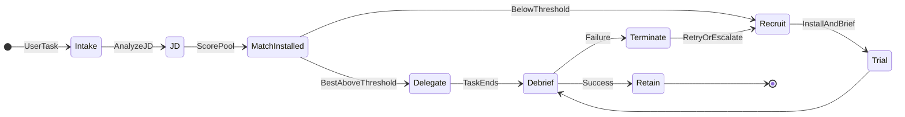
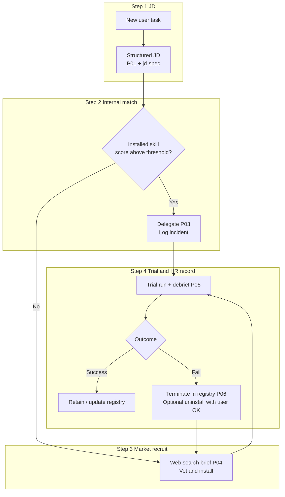
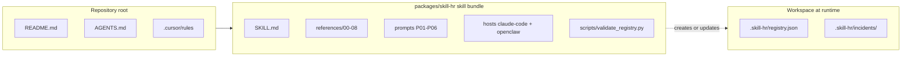

# skill-hr

**Language / 语言:** [English](README.md) | [简体中文](README.zh.md)

Open-source **meta** [Agent Skill](https://support.anthropic.com/en/articles/12580037-what-are-skills) that aims to be **HR for the Skill ecosystem**—not a loose metaphor, but a **professional people-operations layer**: user work becomes a structured **job description (JD)**; **installed** skills are the **internal bench**; gaps trigger **market recruitment** with vetting and trial; **registry + incidents** are the **HRIS / case file** for retain, probation, or **logical termination** (physical uninstall only with explicit user OK). **On OpenClaw, installing this bundle is how you stand up a full-cycle, enterprise-style HR function for skill governance** (headcount, hiring, onboarding handoffs, performance debriefs, offboarding, and re-hire loops).

Primary hosts: **Claude Code**, **OpenClaw** (and **Cursor** via rules). The installable bundle lives under [`packages/skill-hr/`](packages/skill-hr/).

---

## Diagram: HR lifecycle (orchestration state machine)

The runtime mirrors a **full HR cycle**: recruit → trial → performance debrief → retain or terminate → retry if needed.



---

## Diagram: four-step mapping (what the HR function does)



---

## Diagram: repository layout (where files live)



---

## What you get

| Area | Location |
|------|----------|
| **HR department** control plane (orchestration, triggers, safety gates) | [`packages/skill-hr/SKILL.md`](packages/skill-hr/SKILL.md) |
| HR playbooks (competencies, JD, matching, hiring, performance & termination, escalation) | [`packages/skill-hr/references/`](packages/skill-hr/references/) |
| Prompt templates P01–P06 | [`packages/skill-hr/references/prompts/`](packages/skill-hr/references/prompts/) |
| Host notes | [`packages/skill-hr/references/hosts/`](packages/skill-hr/references/hosts/) |
| Registry schema + incident format | [`packages/skill-hr/references/06-state-and-artifacts.md`](packages/skill-hr/references/06-state-and-artifacts.md) |
| Example registry | [`packages/skill-hr/examples/registry.example.json`](packages/skill-hr/examples/registry.example.json) |
| JSON validator | [`packages/skill-hr/scripts/validate_registry.py`](packages/skill-hr/scripts/validate_registry.py) |
| **Framework evaluation** (L0–L7 plan; P02 benchmark = layer L2) | [`packages/skill-hr/references/08-framework-evaluation.md`](packages/skill-hr/references/08-framework-evaluation.md) |
| **P02 matching benchmark** (gold cases + metrics) | [`packages/skill-hr/benchmarks/matching/`](packages/skill-hr/benchmarks/matching/) |
| P02 output schema | [`packages/skill-hr/schemas/p02-output.schema.json`](packages/skill-hr/schemas/p02-output.schema.json) |
| Benchmark scorer | [`packages/skill-hr/scripts/compare_matching_benchmark.py`](packages/skill-hr/scripts/compare_matching_benchmark.py) |

**Suggested Markdown count (skill bundle):** 1× `SKILL.md` + 9× `references/0x–08` + 1× `matching-lexicon` + 6× prompts + 2× hosts ≈ **19** `.md` files inside `packages/skill-hr/` (plus repo-level docs).

---

## Install (quick)

1. Copy [`packages/skill-hr/`](packages/skill-hr/) into your host skills directory as `skill-hr/` so `skill-hr/SKILL.md` exists.
2. **Claude Code:** see [`packages/skill-hr/references/hosts/claude-code.md`](packages/skill-hr/references/hosts/claude-code.md).
3. **OpenClaw:** see [`packages/skill-hr/references/hosts/openclaw.md`](packages/skill-hr/references/hosts/openclaw.md) (**treat `skill-hr` as OpenClaw’s dedicated HR org for skills**).

Optional: add project instructions (e.g. `CLAUDE.md`) that **point** to this skill—keep rules short; procedures stay in `SKILL.md`.

---

## Cursor

Optional rule: [`.cursor/rules/skill-hr-always.mdc`](.cursor/rules/skill-hr-always.mdc) — when to consider `skill-hr` (toggle `alwaysApply` / `globs` as you like).

Agent entry summary: [`AGENTS.md`](AGENTS.md).

---

## Safety

- Third-party skills may be malicious — **vet** before install; do not run unreviewed `curl | sh`.
- **“Delete skill”** defaults to **logical termination** in the registry (`terminated`), not silent filesystem removal.
- **Physical uninstall** only after **explicit user confirmation** and path audit.
- Veto list: [`packages/skill-hr/references/01-competency-model.md`](packages/skill-hr/references/01-competency-model.md).

---

## Framework evaluation

The **full-stack** evaluation plan (L0–L7: package integrity, P01–P06 behavior, registry, safety, E2E) is [`packages/skill-hr/references/08-framework-evaluation.md`](packages/skill-hr/references/08-framework-evaluation.md). The old “benchmark = P02 only” workflow is **one layer (L2)** inside that plan; commands and gold cases for L2 remain in the doc and under `benchmarks/matching/`.

---

## Validate registry

```bash
python packages/skill-hr/scripts/validate_registry.py .skill-hr/registry.json
```

---

## License

MIT — [`packages/skill-hr/LICENSE`](packages/skill-hr/LICENSE).
