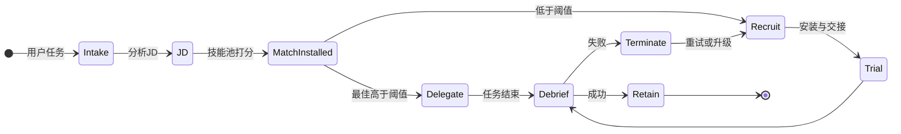
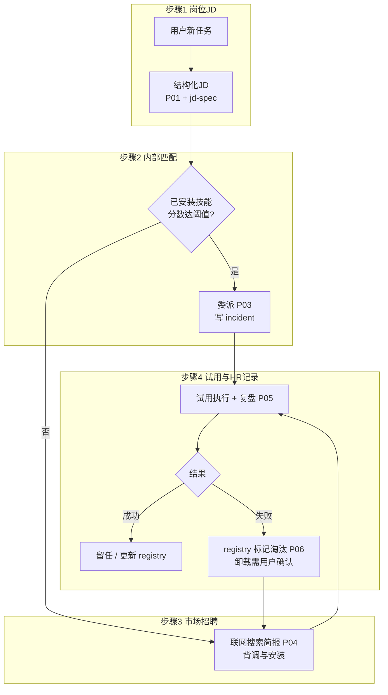
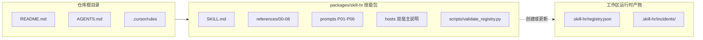

# skill-hr

**语言 / Language:** [简体中文](README.zh.md) | [English](README.md)

> **技能装了一箩筐，任务一来还是不知道派谁？**  
> **别再加插件了，先给宿主招个 HR。**

给 **Claude Code**、**OpenClaw**用的开源 **元 Agent Skill** 仓库，格式就是你熟悉那套：`SKILL.md` + YAML + 可选 `references/`。


| 环节 | 人话 |
|------|------|
| 你甩需求 | 先自动 **写 JD**：这岗到底要啥、边界在哪 |
| 家里有人吗 | **内推池**（已安装技能）打分，够格就 **直接上岗** |
| 家里没人 | **出门社招**：搜一圈、背调、装包、交接，走完整入职 |
| 干完活 | **registry / incidents** 记账：谁稳、谁翻车 |
| 翻车了 | 默认 **逻辑毕业**（从委派池踢走），**不偷偷删你文件夹**；真要物理卸载，得你亲口点头 |

在 **OpenClaw** 上把这包装好 ≈ 给 AI 宿主配了一套 **编制—招聘—入职—复盘—优化结构—再招** 的闭环。不是 README 画饼，是流程写进 skill 里的那种。

包在这：[ `packages/skill-hr/` ](packages/skill-hr/)。

---

## 状态机一图流：从接需求到留任/毕业

用户一开口，后台就开始走 **招聘 → 试用 → 复盘 → 留 or 优化 → 缺人再补** 全套剧本。



---

## 四步走：HR 部门今天到底在肝啥



---

## 地图炮：仓库里 vs 跑起来会多啥文件



---

## 指路表：想查啥直接点

| 你要整这个 | 链接在这 |
|------------|----------|
| **大脑**（编排、啥时候触发、门禁） | [`packages/skill-hr/SKILL.md`](packages/skill-hr/SKILL.md) |
| **员工手册**（能力模型、JD、匹配、招聘、绩效、淘汰、升级） | [`packages/skill-hr/references/`](packages/skill-hr/references/) |
| 提示词 **P01–P06**（拿来即用） | [`packages/skill-hr/references/prompts/`](packages/skill-hr/references/prompts/) |
| 宿主怎么装（**Claude Code / OpenClaw**） | [`packages/skill-hr/references/hosts/`](packages/skill-hr/references/hosts/) |
| registry / incident 长啥样 | [`packages/skill-hr/references/06-state-and-artifacts.md`](packages/skill-hr/references/06-state-and-artifacts.md) |
| 示例 registry（抄作业用） | [`packages/skill-hr/examples/registry.example.json`](packages/skill-hr/examples/registry.example.json) |
| JSON 校验脚本 | [`packages/skill-hr/scripts/validate_registry.py`](packages/skill-hr/scripts/validate_registry.py) |
| **框架测评方案**（L0–L7 全栈；P02 基准 = 其中 L2） | [`packages/skill-hr/references/08-framework-evaluation.md`](packages/skill-hr/references/08-framework-evaluation.md) |
| **P02 匹配基准**（黄金案例 + 指标） | [`packages/skill-hr/benchmarks/matching/`](packages/skill-hr/benchmarks/matching/) |
| P02 输出 JSON Schema | [`packages/skill-hr/schemas/p02-output.schema.json`](packages/skill-hr/schemas/p02-output.schema.json) |
| 基准打分脚本 | [`packages/skill-hr/scripts/compare_matching_benchmark.py`](packages/skill-hr/scripts/compare_matching_benchmark.py) |

**体量参考：** 1×`SKILL.md` + 9×`references/0x–08` + 1×`matching-lexicon` + 6 prompts + 2 hosts ≈ **19** 个 `.md`（根目录还有给人看的 README 之类）。

---

## 三步上岗：安装别装反了

1. 把 [`packages/skill-hr/`](packages/skill-hr/) 丢进宿主 **skills 根目录** 的 `skill-hr/`，确认有 `skill-hr/SKILL.md`。
2. **Claude Code：** 细则 [`packages/skill-hr/references/hosts/claude-code.md`](packages/skill-hr/references/hosts/claude-code.md)。
3. **OpenClaw：** [`packages/skill-hr/references/hosts/openclaw.md`](packages/skill-hr/references/hosts/openclaw.md) —— **当专职 HR 部署**，别当路边小插件随手一塞。

项目里最好写一句 `CLAUDE.md`：**啥时候该把 skill-hr 拉进来**。具体手法全在 `SKILL.md` 和 `references/`（**规则负责喊「开工」，skill 负责教「怎么干」**）。

---

## Cursor 家人

可选规则：[`.cursor/rules/skill-hr-always.mdc`](.cursor/rules/skill-hr-always.mdc) —— 多步骤任务要不要过一遍 HR，自己改 `alwaysApply`、`globs`。

Agent 入口摘要：[ `AGENTS.md` ](AGENTS.md)。

---

## 安全叠甲：背调、毕业、真·卸载

- 外面的 skill **可能是坑**。装之前 **背调（vetting）** 安排上；**未审阅的 `curl | sh` = 高危行为，别头铁。**
- 默认说的「删 skill」= registry 里 **`terminated`**，从委派池移除；**≠ 帮你删盘里的目录**。
- **物理卸载** 只在你 **明确 OK** + 路径对过账之后再动。
- 一票否决清单：[ `packages/skill-hr/references/01-competency-model.md` ](packages/skill-hr/references/01-competency-model.md)。

---

## 框架测评（全链路）

**整框架**测评方案（L0–L7：包完整性、P01–P06 行为、registry、安全、端到端）见 [08-framework-evaluation.md](packages/skill-hr/references/08-framework-evaluation.md)。原先 README 里「测评 = 只跑 P02」已撤下；P02 黄金集与打分命令是该文档中的 **L2 子层**，细节仍以该文与 `benchmarks/matching/` 为准。

---

## 校验 registry（跑一下心里踏实）

```bash
python packages/skill-hr/scripts/validate_registry.py .skill-hr/registry.json
```

---

## 许可证

MIT — [`packages/skill-hr/LICENSE`](packages/skill-hr/LICENSE)。
